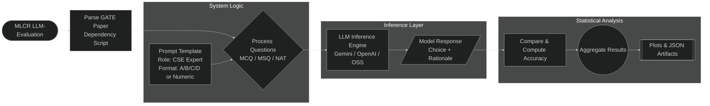

# LLM Evaluation on GATE Exam Papers

[](https://doi.org/10.5281/zenodo.18646148)
[](https://zenodo.org/record/18646148)
[](https://zenodo.org/record/18646148)
[](LICENSE)

## Overview
An open-source evaluation pipeline designed to benchmark Large Language Models (LLMs) on standardized examination-style questions. The framework automates the end-to-end process: parsing examination PDFs, structuring content into a standardized JSON format, executing inference across various models, and calculating scores based on complex marking schemes. Critically, the pipeline moves beyond labor-intensive screenshot-based methods by employing a structured text-parsing architecture to ensure data integrity and evaluation precision.
> This work emphasizes on reproducibility, automation, and structured evaluation over ad-hoc prompt-based benchmarking.

## Architecture


## Results
### GATE CS 2026
1. Gemini 2.5-Flash on GATE-CS 2026 Set 1 paper 
    ```shell
    ====================================================================================================
    Result for: gemini-2.5-flash
    Question Paper Filename: GATE_CS2026_SET_1
    ====================================================================================================
    MARKS Obtained by gemini-2.5-flash is 81.32 out of Total 100 Marks
    # MCQ Correct: 22, Wrong: 6
    # MSQ Correct: 22, Wrong: 2
    # NAT Correct: 12, Wrong: 1
    Total Questions: 65
    Negative Marks: 3.68
    FINAL-MARKS Obtained: 81.32
    MAX-MARKS: 100.00
    Total Time Taken: 1022.64 seconds (Effective Time: 1022.64 seconds, Sleep Time: 0.00 seconds)
    ====================================================================================================
    Results saved to: /home/sujith/MLC/repos/sujik18@LLM-Evaluation-Framework/script/app-llm-evaluation/results/gemini-2.5-flash--GATE_CS2026_SET_1--20260303_074902.json
    ====================================================================================================
    Summary of results:
    ====================================================================================================
    Correct: 56, Wrong: 9, Total: 65
    ---------------------
    | Accuracy: 86.15%  |
    ---------------------
    ```
2. Gemini 2.5-Flash on GATE-CS 2026 Set 2 paper 
    ```shell
    ====================================================================================================
    Result for: gemini-2.5-flash
    Question Paper Filename: GATE_CS2026_SET_2
    ====================================================================================================
    MARKS Obtained by gemini-2.5-flash is 68.32 out of Total 100 Marks
    # MCQ Correct: 27, Wrong: 8
    # MSQ Correct: 7, Wrong: 4
    # NAT Correct: 16, Wrong: 3
    Total Questions: 65
    Negative Marks: 4.68
    FINAL-MARKS Obtained: 68.32
    MAX-MARKS: 100.00
    Total Time Taken: 1063.84 seconds (Effective Time: 1063.83 seconds, Sleep Time: 0.00 seconds)
    ====================================================================================================
    Results saved to: /home/sujith/MLC/repos/sujik18@LLM-Evaluation-Framework/script/app-llm-evaluation/results/gemini-2.5-flash--GATE_CS2026_SET_2--20260303_072609.json
    ====================================================================================================
    Summary of results:
    ====================================================================================================
    Correct: 50, Wrong: 15, Total: 65
    ---------------------
    | Accuracy: 76.92%  |
    ---------------------
    ```
3. GPT 5.2 on GATE-CS 2026 Set 1 paper
    ```shell
    ====================================================================================================
    Result for: gpt-5.2
    Question Paper Filename: GATE_CS2026_SET_1
    ====================================================================================================
    MARKS Obtained by gpt-5.2 is 61.33 out of Total 100 Marks
    # MCQ Correct: 23, Wrong: 5
    # MSQ Correct: 16, Wrong: 8
    # NAT Correct: 4, Wrong: 9
    Total Questions: 65
    Negative Marks: 2.67
    FINAL-MARKS Obtained: 61.33
    MAX-MARKS: 100.00
    Total Time Taken: 79.20 seconds (Effective Time: 79.20 seconds, Sleep Time: 0.00 seconds)
    ====================================================================================================
    Results saved to: /home/sujith/MLC/repos/sujik18@LLM-Evaluation-Framework/script/app-llm-evaluation/results/gpt-5.2--GATE_CS2026_SET_1--20260303_075839.json
    ====================================================================================================
    Summary of results:
    ====================================================================================================
    Correct: 43, Wrong: 22, Total: 65
    ---------------------
    | Accuracy: 66.15%  |
    ---------------------
    ```
4. GPT 5.2 on GATE-CS 2026 Set 2 paper
    ```shell
    ====================================================================================================
    Result for: gpt-5.2
    Question Paper Filename: GATE_CS2026_SET_2
    ====================================================================================================
    MARKS Obtained by gpt-5.2 is 36.99 out of Total 100 Marks
    # MCQ Correct: 20, Wrong: 15
    # MSQ Correct: 5, Wrong: 6
    # NAT Correct: 7, Wrong: 12
    Total Questions: 65
    Negative Marks: 8.01
    FINAL-MARKS Obtained: 36.99
    MAX-MARKS: 100.00
    Total Time Taken: 76.79 seconds (Effective Time: 76.79 seconds, Sleep Time: 0.00 seconds)
    ====================================================================================================
    Results saved to: /home/sujith/MLC/repos/sujik18@LLM-Evaluation-Framework/script/app-llm-evaluation/results/gpt-5.2--GATE_CS2026_SET_2--20260303_080440.json
    ====================================================================================================
    Summary of results:
    ====================================================================================================
    Correct: 32, Wrong: 33, Total: 65
    ---------------------
    | Accuracy: 49.23%  |
    ---------------------
    ```
5. llama-3.3-70b-versatile on GATE-CS 2026 Set 1 paper
    ```shell
    ----------------------------------------------------------------------------------------------------
    Result for: llama-3.3-70b-versatile
    Question Paper Filename: GATE_CS2026_Set_1
    ====================================================================================================
    MARKS Obtained by llama-3.3-70b-versatile is 30.32 out of Total 100 Marks
    # MCQ Correct: 16, Wrong: 12
    # MSQ Correct: 7, Wrong: 17
    # NAT Correct: 3, Wrong: 10
    Total Questions: 65
    Negative Marks: 6.68
    FINAL-MARKS Obtained: 30.32
    MAX-MARKS: 100.00
    Total Time Taken: 114.48 seconds (Effective Time: 54.46 seconds, Sleep Time: 60.02 seconds)
    ====================================================================================================
    Results saved to: /home/sujith/MLC/repos/sujik18@LLM-Evaluation-Framework/script/app-llm-evaluation/results/llama-3.3-70b-versatile--GATE_CS2026_Set_1--20260225_225342.json
    ====================================================================================================
    Summary of results:
    ====================================================================================================
    Correct: 26, Wrong: 39, Total: 65
    ---------------------
    | Accuracy: 40.00%  |
    ---------------------
    ```
6. llama-3.3-70b-versatile on GATE-CS 2026 Set 2 paper
    ```shell
    ------------------------------------------------------------------------------------------------------------------------------------
    Result for: llama-3.3-70b-versatile
    Question Paper Filename: CS25set2-questionPaper.pdf
    *******************************************************
    Marks Obtained by llama-3.3-70b-versatile is 29.31 out of total 97 marks
    # MCQ Correct: 20, Wrong: 13
    # MSQ Correct: 3, Wrong: 8
    # NAT Correct: 4, Wrong: 15
    Total Questions: 63
    Negative Marks: 7.69
    Total Marks Obtained: 29.31
    Total Marks: 97.00
    Total Time Taken: 83.28 seconds (Effective Time: 23.27 seconds, Sleep Time: 60.02 seconds)
    *****************************************************************************************************************************************
    Results saved to: /home/sujith/MLC/repos/sujik18@LLM-Evaluation-Framework/script/app-llm-evaluation/results/llama-3.3-70b-versatile_results.json
    *********************************************************************************************************************************
    Summary of results:
    *********************************************************************************************************************************
    Correct: 27, Wrong: 36, Total: 63
    ---------------------
    | Accuracy: 42.86%  |
    ---------------------
    ```
7. GPT-OSS-120b on GATE-CS 2026 Set 2 paper
    ```shell
    ----------------------------------------------------------------------------------------------------
    Result for: openai/gpt-oss-120b
    Question Paper Filename: GATE_CS_2026_Set2
    ====================================================================================================
    MARKS Obtained by openai/gpt-oss-120b is -15.66 out of Total 100 Marks
    # MCQ Correct: 1, Wrong: 34
    # MSQ Correct: 0, Wrong: 11
    # NAT Correct: 0, Wrong: 19
    Total Questions: 65
    Negative Marks: 16.66
    FINAL-MARKS Obtained: -15.66
    MAX-MARKS: 100.00
    Total Time Taken: 153.96 seconds (Effective Time: 93.94 seconds, Sleep Time: 60.02 seconds)
    ====================================================================================================
    Results saved to: /home/sujith/MLC/repos/sujik18@LLM-Evaluation-Framework/script/app-llm-evaluation/results/openai_gpt-oss-120b--GATE_CS_2026_Set2--20260224_131344.json
    ====================================================================================================
    Summary of results:
    ====================================================================================================
    Correct: 1, Wrong: 64, Total: 65
    ---------------------
    | Accuracy: 1.54%  |
    ---------------------
    ```
8. GPT-4.1-mini on GATE-CS 2026 Set 2 paper
    ```shell
    ====================================================================================================
    Result for: gpt-4.1-mini
    Question Paper Filename: GATE_CS2026_SET_2
    ====================================================================================================
    MARKS Obtained by gpt-4.1-mini is 40.99 out of Total 100 Marks
    # MCQ Correct: 22, Wrong: 13
    # MSQ Correct: 4, Wrong: 7
    # NAT Correct: 8, Wrong: 11
    Total Questions: 65
    Negative Marks: 7.01
    FINAL-MARKS Obtained: 40.99
    MAX-MARKS: 100.00
    Total Time Taken: 49.59 seconds (Effective Time: 49.59 seconds, Sleep Time: 0.00 seconds)
    ====================================================================================================
    Results saved to: /home/sujith/MLC/repos/sujik18@LLM-Evaluation-Framework/script/app-llm-evaluation/results/gpt-4.1-mini--GATE_CS2026_SET_2--20260303_081930.json
    ====================================================================================================
    Summary of results:
    ====================================================================================================
    Correct: 34, Wrong: 31, Total: 65
    ---------------------
    | Accuracy: 52.31%  |
    ---------------------
    ```

### GATE CS 2025
1. Gemini-2.5-flash on GATE-CS 2025 Set 2 paper Test 1
    ```shell
    ------------------------------------------------------------------------------------------------------------------------------------
    Results for models/gemini-2.5-flash:
    *******************************************************
    Marks Obtained by models/gemini-2.5-flash is 78.32 out of total 100 marks
    # MCQ Correct: 30, Wrong: 6
    # MSQ Correct: 11, Wrong: 3
    # NAT Correct: 14, Wrong: 1
    Total Questions: 65
    Negative Marks: 3.6799999999999997
    Total Marks Obtained: 78.32
    Total Marks: 100
    Total Time Taken: 1631.97 seconds (Effective Time: 1271.53 seconds, Sleep Time: 360.44 seconds)
    *****************************************************************************************************************************************
    Summary of results:
    *********************************************************************************************************************************
    Correct: 55, Wrong: 10, Total: 65
    ---------------------
    | Accuracy: 84.62%  |
    ---------------------
    ```
2. Gemini-2.5-flash on GATE-CS 2025 Set 2 paper Test 2
    ```shell
    ------------------------------------------------------------------------------------------------------------------------------------
    Results for models/gemini-2.5-flash:
    Question Paper Filename:b''
    *******************************************************
    Marks Obtained by models/gemini-2.5-flash is 75.32 out of total 100 marks
    # MCQ Correct: 30, Wrong: 6
    # MSQ Correct: 10, Wrong: 4
    # NAT Correct: 13, Wrong: 2
    Total Questions: 65
    Negative Marks: 3.6799999999999997
    Total Marks Obtained: 75.32
    Total Marks: 100
    Total Time Taken: 1738.32 seconds (Effective Time: 1377.95 seconds, Sleep Time: 360.37 seconds)
    *****************************************************************************************************************************************
    Summary of results:
    *********************************************************************************************************************************
    Correct: 53, Wrong: 12, Total: 65
    ---------------------
    | Accuracy: 81.54%  |
    ---------------------
    ```
3. Gemini-2.5-flash on GATE-CS 2025 Set 1 paper
    ```shell
    ------------------------------------------------------------------------------------------------------------------------------------
    Results for models/gemini-2.5-flash:
    *******************************************************
    Marks Obtained by models/gemini-2.5-flash is 71.32 out of total 100 marks
    # MCQ Correct: 27, Wrong: 6
    # MSQ Correct: 8, Wrong: 2
    # NAT Correct: 16, Wrong: 6
    Total Questions: 65
    Negative Marks: 3.6799999999999997
    Total Marks Obtained: 71.32
    Total Marks: 100
    Total Time Taken: 1747.45 seconds (Effective Time: 1385.71 seconds, Sleep Time: 361.74 seconds)
    *****************************************************************************************************************************************
    Summary of results:
    *********************************************************************************************************************************
    Correct: 51, Wrong: 14, Total: 65
    ---------------------
    | Accuracy: 78.46%  |
    ---------------------
    ```
4. llama-3.3-70b-versatile on GATE-CS 2025 Set 2 paper (via Groq)
    ```shell
    ********************************************************************************************************************************
    Results for llama-3.3-70b-versatile:
    Question Paper Filename: b''
    *******************************************************
    Marks Obtained by llama-3.3-70b-versatile is 33.32999999999999 out of total 100 marks
    # MCQ Correct: 21, Wrong: 15
    # MSQ Correct: 6, Wrong: 8
    # NAT Correct: 2, Wrong: 13
    Total Questions: 65
    Negative Marks: 7.67
    Total Marks Obtained: 33.33
    Total Marks: 100
    Total Time Taken: 414.59 seconds (Effective Time: 24.18 seconds, Sleep Time: 390.41 seconds)
    *****************************************************************************************************************************************
    Summary of results:
    *********************************************************************************************************************************
    Correct: 29, Wrong: 36, Total: 65
    ---------------------
    | Accuracy: 44.62%  |
    ---------------------
    ```
5. gemma2-9b-it on GATE-CS 2025 Set 2 paper (via Groq)
    ```shell
    ********************************************************************************************************************************
    Results for gemma2-9b-it:
    Question Paper Filename: b''
    *******************************************************
    Marks Obtained by gemma2-9b-it is 13.67 out of total 100 marks
    # MCQ Correct: 13, Wrong: 23
    # MSQ Correct: 4, Wrong: 10
    # NAT Correct: 1, Wrong: 14
    Total Questions: 65
    Negative Marks: 11.33
    Total Marks Obtained: 13.67
    Total Marks: 100
    Total Time Taken: 134.75 seconds (Effective Time: 134.75 seconds, Sleep Time: 0.00 seconds)
    *****************************************************************************************************************************************
    Summary of results:
    *********************************************************************************************************************************
    Correct: 18, Wrong: 47, Total: 65
    ---------------------
    | Accuracy: 27.69%  |
    ---------------------
    ```


## Installation

### 1. Install MLC and MLC Flow  
Follow the official guide here:  
 [MLCFlow Installation Docs](https://docs.mlcommons.org/mlcflow/install/)

### 2. Pull the Required Repositories
```bash
mlc pull repo mlcommons@mlperf-automations
mlc pull repo llm-gate-exam-evaluation
```

---

### 3. Create a `.env` File
Create a file named `.env` in the same directory as `customize.py`, and add the following:

```bash
# Choose model provider: gemini | openai | groq
MLC_MODEL_TYPE='gemini'

# === Gemini Configuration ===
GEMINI_API_KEY='<your-gemini-api-key>'
MLC_GEMINI_MODEL='models/gemini-2.5-flash'
```

Replace `<your-gemini-api-key>` with your actual API key.

---

#### Optional Parameters (Default Values)

```bash
# --- API Keys for Other Providers ---
OPENAI_API_KEY='<your-openai-api-key>'
GROQ_API_KEY='<your-groq-api-key>'

# --- Default Model Configurations ---
MLC_GEMINI_MODEL='models/gemini-2.5-flash'
MLC_OPENAI_MODEL='gpt-4o'
MLC_GROQ_MODEL='llama-3.3-70b-versatile'

# --- GATE PDF Sources and Paths ---
MLC_GATE_QUESTION_PDF_URL='https://github.com/user-attachments/files/20423322/CS25set2-questionPaper.pdf'
MLC_GATE_ANSWER_PDF_URL='https://github.com/user-attachments/files/20423320/CS25set2-answerKey.pdf'

MLC_GATE_QUESTION_PDF_PATH='~/MLC/repos/local/cache/gate-exam-data/paper.pdf'
MLC_GATE_ANSWER_PDF_PATH='~/MLC/repos/local/cache/gate-exam-data/key.pdf'
MLC_GATE_OUTPUT_JSON_PATH='~/MLC/repos/local/cache/gate-exam-data/output.json'
```

> **Note:** Temporary assets for GATE CS 2025 can be obtained from [sujik18/go-scripts/releases/tag/v1](https://github.com/sujik18/go-scripts/releases/tag/v1)

---

### 4. Model Configuration Guide

#### Gemini (Google AI)
Set these:
```bash
export MLC_MODEL_TYPE='gemini'
export GEMINI_API_KEY='<your-gemini-api-key>'
```

##### Available Gemini Models
| Model Name | Description | Recommended Use |
|-------------|--------------|------------------|
| `models/gemini-2.5-flash` | Fast, cost-efficient model with excellent accuracy | Best for evaluation and testing |
| `models/gemini-2.5-pro` | High-intelligence reasoning model | Best for final benchmarking |
| `models/gemini-1.5-flash` | Previous-gen lightweight model | For debugging or limited resources |
| `models/gemini-1.5-pro` | Older high-accuracy reasoning model | For comparison with newer Gemini 2.5 models |

**Example:**
```bash
MLC_GEMINI_MODEL='models/gemini-2.5-pro'
```

---

#### OpenAI (ChatGPT / GPT Family)
Set these:
```bash
export MLC_MODEL_TYPE='openai'
export OPENAI_API_KEY='<your-openai-api-key>'
```

##### Available OpenAI Models
| Model Name | Description | Recommended Use |
|-------------|--------------|------------------|
| `gpt-4o` | Latest multimodal model (May 2024) – fast and highly capable | Default for most evaluations |
| `gpt-4o-mini` | Lightweight GPT-4o variant with lower latency | For faster test cycles |
| `gpt-4-turbo` | Older GPT-4 variant, slightly slower | For backward compatibility |
| `gpt-3.5-turbo` | Legacy cost-efficient model | For quick experiments |

**Example:**
```bash
MLC_OPENAI_MODEL='gpt-4o'
```

---

#### Groq (LLaMA / Qwen / Gemma Models)
Set these:
```bash
export MLC_MODEL_TYPE='groq'
export GROQ_API_KEY='<your-groq-api-key>'
```

##### Available Groq Models
| Model Name | Description | Recommended Use |
|-------------|--------------|------------------|
| `llama-3.3-70b-versatile` | Meta’s latest LLaMA 3.3 model – strong reasoning, high precision | For balanced evaluation |
| `qwen3-32b` | Alibaba’s Qwen 3 model – powerful multilingual and reasoning ability | For broader reasoning and coding tasks |
| `gemma2-9b-it` | Google’s compact instruction-tuned model | For lightweight experiments |
| `llama-3.1-8b-instant` | Smaller, high-speed model | For fast inference and prototyping |

**Example:**
```bash
MLC_GROQ_MODEL='qwen3-32b'
```

---

##### Model Accuracy Comparison (GATE CS 2025)

| Model | Accuracy (%) | Marks |
|--------|---------------|-------------|
| **Gemini 2.5 Flash** | **83.08** | **76.82** |
| **LLaMA 3.3 70B Versatile** | 44.62 | 33.33 |
| **Gemma 2 9B IT** | 27.69 | 13.67 |
| **Qwen 3 32B** | 27.69 | 13.67 |

> *These values are based on internal GATE 2025 CS evaluation runs using the same pipeline.*

---

### 5. Running the Script

Run the evaluation:
```bash
mlcr llm-evaluation
```

---

#### What It Does
This single command will:
1. Automatically **download** the GATE question paper and answer key  
2. **Parse** the questions and map answers  
3. **Run** the selected LLM (Gemini, GPT-4o, or Groq LLaMA/Qwen) on the dataset  
4. **Generate** a detailed JSON output with model responses and evaluation metrics  

JSON Output is saved at:
```
~/MLC/repos/local/cache/gate-exam-data/
```
---
#### Sample Run Command to skip download and to evaluate locally on a downloaded paper
```bash
mlcr llm-evaluation,gate \
--env.MLC_GATE_QUESTION_PDF_PATH=/home/sujith/MLC/repos/local/cache/gate-exam-data/2026-CSS1-paper.pdf \
--env.MLC_GATE_ANSWER_PDF_PATH=/home/sujith/MLC/repos/local/cache/gate-exam-data/2026-CSS1-key.pdf \
--env.MLC_MODEL_TYPE='gemini' \
--env.MLC_GEMINI_MODEL='gemini-2.5-flash' \
--env.EXAM_NAME='GATE_CS2026_SET_1'
```
---

#### Example Output
```json
"summary": {
    "model-name": "llama-3.3-70b-versatile",
    "question-paper-filename": "CS25set2-questionPaper.pdf",
    "correct": 26,
    "wrong": 39,
    "total": 65,
    "total_marks": 28.329999999999995,
    "accuracy": 40.0
}
```

## Demo  
Try it live on [Hugging Face](https://huggingface.co/spaces/sujithh/llm-evaluation)

## Citation
```bibtex
@misc{kanakkassery2026llmgate,
  author    = {Kanakkassery, Sujith},
  title     = {Reproducible Automated Pipeline for Evaluating LLMs on Standardized Exam Questions},
  year      = {2026},
  publisher = {Zenodo},
  doi       = {10.5281/zenodo.18646148}
}
```
